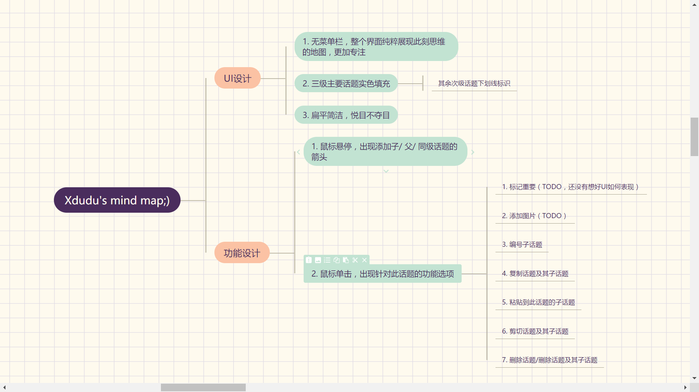

可能每个人都会对自己经常使用的工具产生自己的想法和憧憬吧——“如果这里是这样就更好了”，“如果还有XX功能就好了”之类的。这次也是借着学习的名义:stuck_out_tongue_closed_eyes:，想自己动手做一款应用，灵感就是来源于之前一直有在使用的工具：思维导图。
___
有了学习React的想法后，突然觉得从这个应用入手学习还挺好的。第一，不管是topic的呈现还是与用户的交互，UI组件容易抽象，数量也不多，适合将之作为边学习边实践的产物；第二，整个应用在架构和功能上如果要做得漂亮，还是有一定思维复杂度的，肯定有一些能被虐到的点:information_desk_person:，没错，我就是这么变态哈哈。再加上立志要做出好！看！的界面和自己觉得舒服的交互，就这么开始了~
___
目前做出的应用在线版放在[GitHub Pages](https://xdudu.github.io/mind-map/)，截图如下，附带功能介绍：

基本的想法就是简洁的界面，从思维导图的基本功能（新建及编辑话题，话题的复制粘贴等操作）开始，逐步加上图中提到的标记重要，添加图片，以及客户端存储等其他功能。
___
非常感谢[create-react-app](https://github.com/facebookincubator/create-react-app)项目，让我第一个React项目可以专注学习于React本身相关知识。从刚开始看到JSX突兀地出现在官网示例上有些发怵，到写出第一个component的欣慰，到为整个应用结构发愁，再到后来每天都在挣扎跨越各种难关，我也明白了其实所有的问题，只要不妥协或者放弃，你一定能找到当时你认为不错的解决方法。不管是功能还是代码上，不足之处还有很多，不断利用所学保持更新吧~
